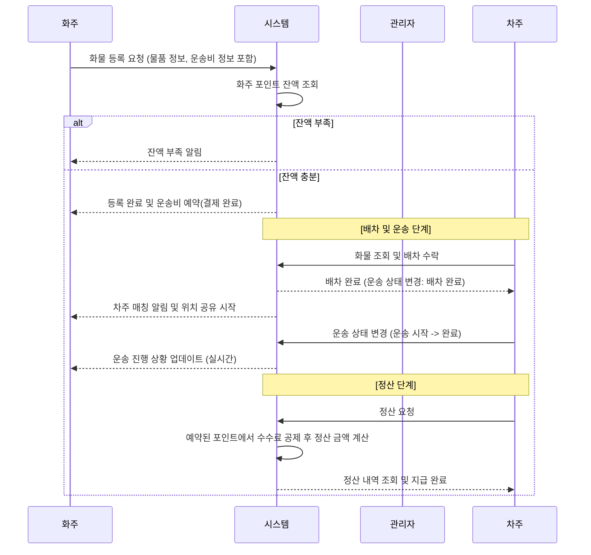

## 더조은 컴퓨터 아카데미 최종 프로젝트
### 화물 운송 중계 플랫폼
# 🚚 BoxMon (화물 운송 중계 플랫폼)
> 화주(화물)와 차주/운송사를 빠르게 매칭하고, 배차·운송·정산까지 한 번에 관리하는 플랫폼

---

## ✨ 핵심 기능
### 화주(Shipper)
- 화물 등록(출발/도착, 상·하차 방식, 톤수/차종, 희망 운임)
- 배차 제안 수신 및 선택(운송사/차주 프로필, 평점/리뷰 기반)
- 운송 상태 실시간 추적(상차/이동/하차/완료)
- 운송 완료 후 정산/세금계산서/영수증 관리

### 차주/운송사(Carrier)
- 배차 공고 탐색 및 지원(조건 필터, 경로/거리 기반 추천)
- 운송 진행 상태 업데이트(상차/하차 증빙 업로드)
- 운송 이력 및 수익 리포트

### 운영/관리(Admin)
- 사용자/차량/서류 승인(KYC, 차량 등록증 등)
- 분쟁/클레임 관리, 평점/리뷰 모니터링
- 운임 정책/수수료/프로모션 관리

---
## 🗺️ 데이터베이스 설계 (ERD)

## 🧩 서비스 흐름

